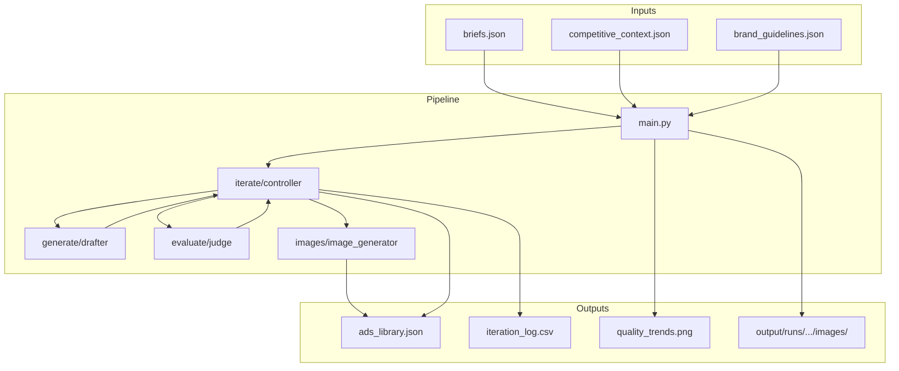
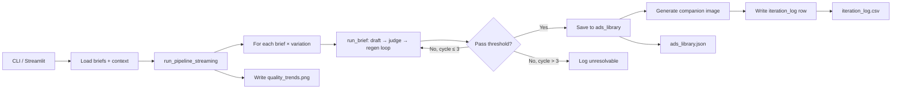
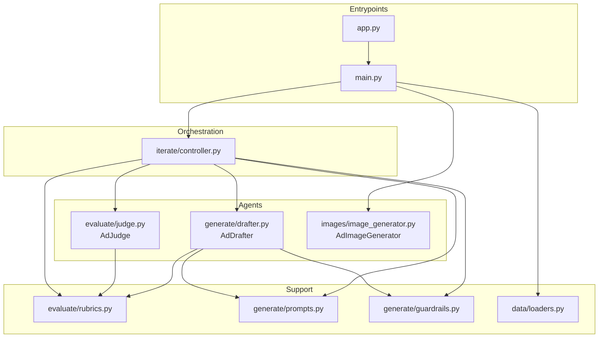
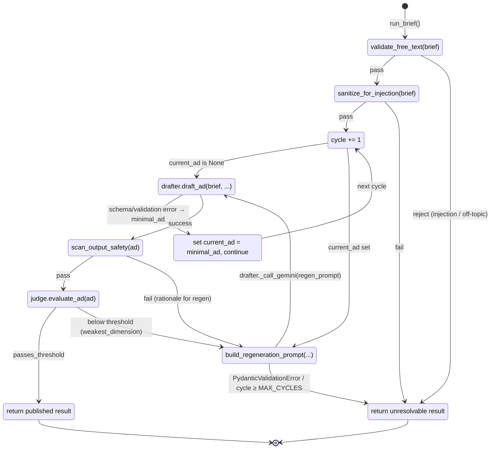
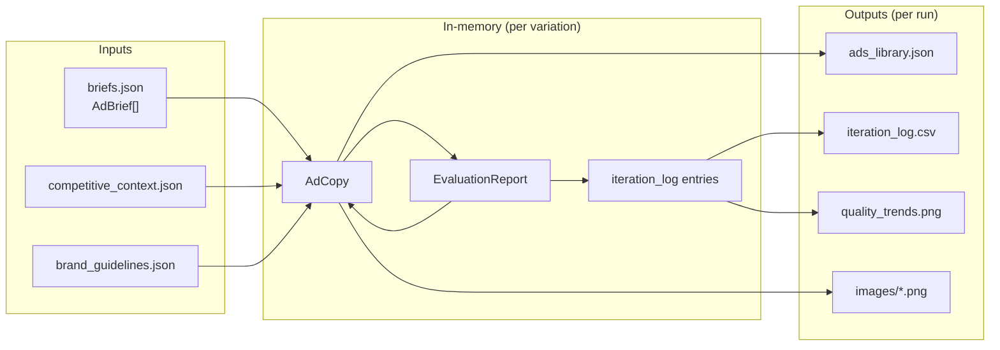
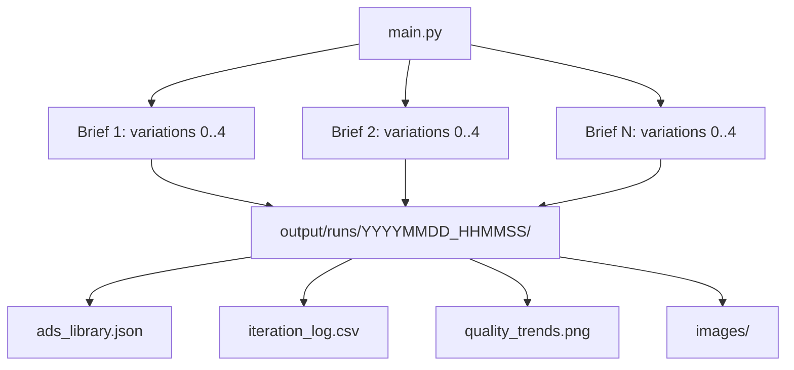

# Agent Architecture — Shreelakshmi Ad Engine

This document describes the multi-agent architecture of the Shreelakshmi Ad Engine: components, data flow, and how the pipeline orchestrates drafting, evaluation, and self-healing iteration.

---

## 1. System Overview

The system is a **multi-model pipeline** that turns ad briefs into publishable creative: a **Drafter** (Gemini, Claude fallback) generates copy, a **Judge** (Claude Sonnet) scores it on five dimensions, and a **Controller** runs up to 3 cycles (MAX_EVALUATION_CYCLES = 3) of targeted regeneration until quality meets a 7.0/10 threshold. Passing ads receive companion images from an **Image Generator** (Gemini 2.5 Flash Image, a.k.a. "Nano Banana"), which runs as a Phase 2 pass after the quality loop completes.

---

## 2. High-Level Pipeline Flow

End-to-end flow from entrypoint to artifacts:

- **main.py** loads data and invokes `run_pipeline_streaming()` (generator).
- Each **(brief, variation)** is handled by **iterate/controller.run_brief()**.
- **Controller** calls **Drafter** and **Judge**; on failure to meet 7.0 it builds a regeneration prompt and loops (max 3 cycles).
- Published ads are written to the run’s `ads_library.json`; **Image Generator** runs only for passing ads.
- **iteration_log.csv** gets one row per evaluation event; **quality_trends.png** is written at the end of the run.

---

## 3. Component Diagram

Modules and their responsibilities:

| Component | Role |
|-----------|------|
| **main.py** | Loads data, runs `run_pipeline_streaming()`, writes run dir (ads_library, iteration_log, quality_trends, images). |
| **app.py** | Streamlit UI; runs `main.py` as subprocess, streams stdout, displays runs and metrics. |
| **iterate/controller** | Runs the per–(brief, variation) loop: draft → safety scan → judge → regen or publish; enforces 3-cycle cap and `unresolvable` handling. |
| **generate/drafter** | **Drafter agent.** Gemini 2.5 Flash (primary), Claude Haiku 4.5 (fallback on Gemini ResourceExhausted). Produces AdCopy (primary_text, headline, description, cta_button, image_prompt). |
| **evaluate/judge** | **Judge agent.** Claude Sonnet 4.5. Scores AdCopy on 5 dimensions, returns EvaluationReport (scores, rationales, average_score, passes_threshold, weakest_dimension). |
| **images/image_generator** | **Image agent.** Gemini 2.5 Flash Image. One image per passing ad from image_prompt; writes PNG under run’s `images/`. |
| **evaluate/rubrics** | Shared constants (QUALITY_THRESHOLD, MAX_CYCLES), calibration anchors (GOLD_ANCHOR, POOR_ANCHOR), Pydantic schemas (AdCopy, EvaluationReport, AdBrief), `scan_output_safety()`. |
| **generate/prompts** | Drafter system prompt, `build_drafter_prompt()`, `sanitize_for_injection()`. |
| **generate/guardrails** | `validate_free_text(brief)` — rejects off-topic or injection attempts before drafting. |
| **data/loaders** | `load_briefs()`, `load_competitive_context()`, `load_brand_guidelines()`. |

---

## 4. Per-Brief Iteration Loop (Controller)

Inside `run_brief()`, each variation goes through a fixed cycle cap (MAX_CYCLES = 3):

- **Gates 1–2:** Guardrails and sanitization; on failure the brief is not sent to the Drafter.
- **Draft:** First cycle uses the full brief; later cycles use a targeted regeneration prompt.
- **Scan:** Safety check (competitor names, PII patterns, forbidden words); failure can feed into regen rationale.
- **Judge:** Produces scores and weakest dimension; `passes_threshold` (average ≥ 7.0) → publish; else → regen.
- **Regen:** Controller builds a surgical prompt using `DIMENSION_FIX_STRATEGIES` — a per-dimension playbook of concrete "say X not Y" rewriting instructions. For example, when `brand_voice` is weakest, the strategy says things like "Say 'your child' NOT 'your student'; say 'SAT tutoring' NOT 'SAT prep'; lead with outcomes, not features; never use empty adjectives like 'personalized' or 'data-driven'." The Drafter is told to preserve the strong dimensions and only rewrite the weakest one.
- **Fallback during regen:** If `_call_gemini` raises `ResourceExhausted` after all Tenacity retries, `_call_claude` (Haiku) is invoked as a drafter fallback using the same prompt.
- **Termination:** On Pydantic `ValidationError` or after 3 cycles without passing → `unresolvable`, logged with full diagnostic data.
- **Error reporting:** Failed variations include error reasons in pipeline output for visibility and debugging.

---

## 5. Data Flow

Inputs, in-memory structures, and outputs:

- **AdBrief:** id, audience, product, goal, tone, hook_type, difficulty (from briefs.json).
- **AdCopy:** primary_text, headline, description, cta_button, image_prompt (Drafter output; Pydantic-validated).
- **EvaluationReport:** Five dimension scores + rationales, average_score, passes_threshold, weakest_dimension (Judge output; `average_score` / `passes_threshold` / `weakest_dimension` computed in rubrics, not trusted from LLM).
- **iteration_log:** One row per evaluation event (cycle, scores, status, tokens, cost).
- **ads_library:** One entry per published ad (ad_copy, scores, image_url, tokens, cost).
- **quality_trends.png:** Mean score by cycle across the run.

---

## 5a. Drafter Prompt Structure — Bookended Constraints

The Drafter prompt in `generate/prompts.py` is structured to counter the **"Lost in the Middle"** failure mode, where LLMs reliably attend to the start and end of a prompt but drop instructions placed in the middle. The prompt shape is:

1. **Top bookend** — Critical constraints and forbidden words stated upfront (before any context).
2. **Context block** — Brief, competitive context, brand guidelines.
3. **Few-shot examples** — Paired `GOOD` and `BAD` ad examples that show the voice concretely rather than describing it abstractly. This is far more effective than rule enumeration for style dimensions like `brand_voice`.
4. **Output format** — JSON schema the Drafter must return.
5. **Bottom bookend** — The *same* critical constraints restated immediately before generation. Not a stylistic duplicate; attention weight at the tail of the prompt is high, and duplicating is the cheapest reliable way to hold the model to them.

The brand voice fix work specifically leaned on the bottom bookend plus the few-shot examples. Abstract rules like "avoid generic marketing language" consistently failed; a concrete `GOOD`/`BAD` pair made the model produce the right voice on first draft, and the bookends held the line on forbidden words.

See the DECISION_LOG entry "Drafter Prompt Restructure — Bookended Constraints and Few-Shot Examples" for the rationale.

---

## 6. Agent Roles Summary

| Agent | Model(s) | Input | Output |
|-------|----------|--------|--------|
| **Drafter** | Gemini 2.5 Flash (primary), Claude Haiku 4.5 (fallback on Gemini ResourceExhausted) | AdBrief + competitive_context + brand_guidelines (or regen prompt) | AdCopy (JSON → Pydantic) or structured error with raw_draft/validation_errors |
| **Judge** | Claude Sonnet 4.5 | AdCopy | EvaluationReport (scores, rationales, average_score, passes_threshold, weakest_dimension) |
| **Controller** | — | AdBrief, variation_index, seed, context, brand_guidelines | Run state: draft → scan → judge → regen loop; returns published or unresolvable + iteration_log |
| **Image Generator** | Gemini 2.5 Flash Image | image_prompt (from AdCopy) + ad_id | PNG path (saved under run’s images/) or error |

---

## 7. Concurrency, Rate Limiting, and Run Layout

Concurrency is a two-tier model: a thread pool that dispatches pipeline work, plus **per-provider semaphores** that gate the actual API calls underneath it. This separation lets us parallelize orchestration without overrunning provider rate limits.

**Layer 1 — Pipeline thread pool (`main.py`)**
- Variations are dispatched via `ThreadPoolExecutor` with `PIPELINE_MAX_WORKERS = 5` (reduced from 10 after rate-limit analysis — see DECISION_LOG entry "Rate Limit Throttling").
- `IMAGE_MAX_WORKERS = 4` for the Phase 2 image generation pool (runs after the quality loop).
- Variations per brief: `VARIATIONS_PER_BRIEF = 5` (env var).

**Layer 2 — API semaphores (`rate_limiter.py`)**
- `GEMINI_MAX_CONCURRENT = 5` — acquired inside `drafter._call_gemini()` before every Gemini call.
- `ANTHROPIC_MAX_CONCURRENT = 2` — acquired inside `drafter._call_claude()` and `judge.evaluate_ad()` before every Anthropic call. This is the tightest gate in the system; Anthropic Tier 1 only allows 50 RPM across all models and Sonnet only 30K TPM.
- `ANTHROPIC_CALL_DELAY = 2.0` seconds — `time.sleep()` inside the `finally:` block of every Anthropic call, *before* the semaphore is released. This paces token consumption to stay under 30K TPM regardless of how fast threads queue up.

**Why the delay lives inside `finally:`, not around the call**
If the sleep ran outside the semaphore, N threads could all fire Anthropic requests simultaneously and then sleep in parallel — the delay would have no throttling effect. By holding the semaphore across the sleep, effective TPM is bounded by `ANTHROPIC_MAX_CONCURRENT / (call_duration + ANTHROPIC_CALL_DELAY)`.

**Retry strategy**
- Gemini: `@retry(retry_if_exception_type(ResourceExhausted), stop_after_attempt(5), wait_exponential(multiplier=1, min=2, max=15))` on `_call_gemini`. Previously `stop_after_attempt(3)` with narrower backoff — widened after observing transient 429s on brief_007.
- Anthropic: No explicit retry decorator on Claude calls — the semaphore + delay combination is sufficient at current volume. If this assumption breaks at higher volumes, add `@retry` on `_call_claude` with the same signature.

**Run layout (unchanged)**
- Each run gets a timestamped directory: `output/runs/YYYYMMDD_HHMMSS/`.
- Under that directory: `ads_library.json`, `iteration_log.csv`, `quality_trends.png`, `images/`.
- The latest run's `ads_library.json` and `quality_trends.png` are also written to `output/` for convenience.

---

## 8. File Reference

| File | Purpose |
|------|---------|
| **main.py** | CLI entry; `run_pipeline_streaming()`, `run_cli_pipeline()`, run directory and output wiring. |
| **app.py** | Streamlit dashboard; runs main as subprocess, shows runs and charts. |
| **iterate/controller.py** | `run_brief()`, `build_regeneration_prompt()`, cycle and unresolvable logic. |
| **generate/drafter.py** | `AdDrafter`, `draft_ad()`, `_call_gemini` / `_call_claude`, JSON cleaning. |
| **evaluate/judge.py** | `AdJudge`, `evaluate_ad()`, prompt with GOLD/POOR anchors. |
| **images/image_generator.py** | `AdImageGenerator`, `generate_image()`, `_invoke_model()`. |
| **evaluate/rubrics.py** | Schemas, thresholds, anchors, `scan_output_safety()`. |
| **generate/prompts.py** | Drafter prompt builder, sanitization. |
| **generate/guardrails.py** | `validate_free_text()`. |
| **data/loaders.py** | Load briefs, competitive context, brand guidelines. |

For product and evaluation criteria, see [docs/02_Product_Requirements_Document.md](docs/02_Product_Requirements_Document.md). For design rationale and failures, see [Decision Log](docs/DECISION_LOG.md).

---

## 9. Streamlit UI (app.py)

### Version and Architecture
- **Streamlit version:** 1.45.1 (includes SessionInfo race condition fix)
- **Theme:** "Kinetic Observatory" with dark palette:
  - Background: `#0a0e14`
  - Primary: `#69daff` (cyan)
  - Secondary: `#00fc40` (bright green)
  - Tertiary: `#ac89ff` (purple)
- **Fonts:** Inter + Space Grotesk

### Navigation and Layout
- **Navigation:** `st.radio()` with `key=` parameter (no `index=`); CSS hides radio button dots
- **Sidebar:** `<section>` element (Streamlit 1.45.1+) containing navigation and filters
- **Page container:** All page content wrapped in `st.container()` for atomic DOM replacement on page switch
- **Pages:**
  - Dashboard (summary of all runs, quality trends chart)
  - Library (gallery of generated ads)
  - Self-Healing (detailed iteration logs and variant analysis)
  - Run Pipeline (execute pipeline with progress streaming)
  - Settings (UI preferences)
  - *(Note: Analytics page was removed in current implementation)*

### Gallery and Filtering
- **Gallery filters:** `st.radio()` with options:
  - "All Ads" (all variations)
  - "Top Performers" (score ≥ 8.0)
  - "Needs Image" (checks top-level `image_url` field)
- **Ad images:** Base64-encoded inline with caching via `@st.cache_data(ttl=300)` on `_load_image_b64()`
- **Image display:** CSS uses `height: auto` for responsive sizing (no fixed 170px with object-fit:cover)
- **Read more toggle:** Uses `

` HTML elements (not JavaScript onclick)

### Caching Strategy
- `@st.cache_data(ttl=30)` applied to:
  - `load_ads_library_result()` — refreshes every 30 seconds
  - `load_iteration_log_df()` — refreshes every 30 seconds
- `@st.cache_data(ttl=300)` applied to:
  - `_load_image_b64()` — image base64 encoding, 5-minute TTL

### Data Loading
- **Run selector:** Loads available runs AFTER widget renders using return value
- **Asynchronous updates:** Uses streaming callbacks to display iteration progress in real-time

### Configuration Constants
| Constant | Value | Purpose |
|----------|-------|---------|
| `VARIATIONS_PER_BRIEF` | 5 (env) | Number of variations per brief |
| `PIPELINE_MAX_WORKERS` | 5 (env) | Max concurrent brief/variation workers (was 10; reduced to ease rate pressure) |
| `GEMINI_MAX_CONCURRENT` | 5 (env) | Semaphore cap on simultaneous Gemini calls (`rate_limiter.py`) |
| `ANTHROPIC_MAX_CONCURRENT` | 2 (env) | Semaphore cap on simultaneous Anthropic calls (tightest gate) |
| `ANTHROPIC_CALL_DELAY` | 2.0 seconds (env) | Sleep inside `finally:` of every Anthropic call, holding the semaphore — paces token consumption to stay under 30K TPM |
| `IMAGE_MAX_WORKERS` | 4 | Max concurrent image generation workers for the Phase 2 image pass |
| `IMAGE_STAGGER_DELAY` | 2.0 seconds | Delay between image generation starts to avoid burst rate-limit hits on the image model |
| `MAX_EVALUATION_CYCLES` | 3 | Max iterations per variation (in `rubrics.py`) |
| `QUALITY_THRESHOLD` | 7.0 | Judge average-score bar for publish (`rubrics.py`) |
